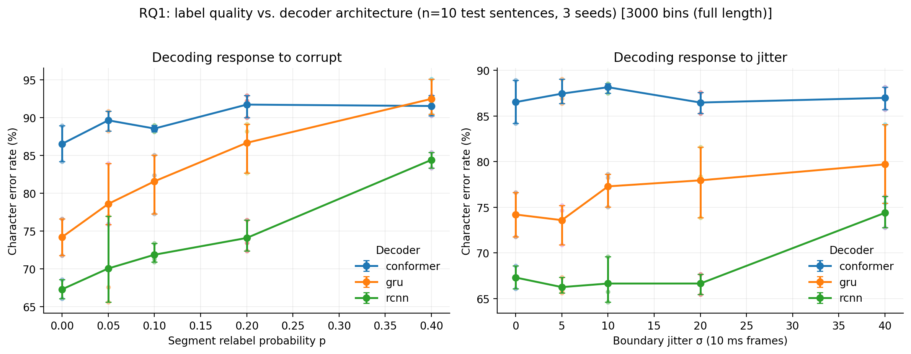

# Alignment error *type*, not error *rate*, limits handwriting BCI decoding

A controlled study of how much brain-to-text decoding accuracy depends on the quality of its
forced-alignment labels, building on [Willett et al. (Nature 2021)](https://www.nature.com/articles/s41586-021-03506-2).

The Willett pipeline trains its decoder on frame-level character labels produced by a hidden
Markov model. Those labels are **not ground truth**: nobody observed which character the
participant was imagining at a given 10 ms bin. They come from a generative model fit to
isolated letters and transferred to continuous sentences, and every downstream decoder
inherits whatever error they contain. The literature has explored decoder architectures and
language models extensively while treating the alignment stage as fixed infrastructure.

**This project measures the decoding response to controlled degradation of those labels.**
198 training runs, two corruption models, five severity levels, three architectures, three
seeds, two sequence-length regimes.

📄 **[Read the writeup](docs/RQ1_alignment_error_types.md)** ·
📋 **[Research plan](docs/RESEARCH_PLAN.md)** (hypotheses fixed before running) ·
📓 **[Lab notebook](docs/LAB_NOTEBOOK.md)** (dated record, including what went wrong)

---

## Findings

### 1. Timing errors are nearly free. Identity errors are expensive.

Displacing character boundaries so that up to **17% of frame labels change** has **no
measurable effect** on the best decoder. Relabelling the same proportion to the *wrong
character* costs accuracy immediately and compounds.

RCNN, character error rate change from clean labels (measured fraction of frames changed):

| Frames changed | Boundary jitter | Identity corruption |
|---|---|---|
| 4-5% | **-1.0 pp** | +2.8 pp |
| 8-10% | **-0.7 pp** | +4.6 pp |
| 17-20% | **-0.7 pp** | +6.8 pp |
| 31-40% | +7.1 pp | +17.1 pp |

Across architectures, corruption is **2.4x to 10.8x steeper** than jitter. The decoding
pipeline smooths posteriors over 51 frames against roughly 75-frame characters, so mistimed
boundaries are absorbed; a wrong character identity is unrecoverable at any smoothing width.

**A forced aligner does not need to be temporally precise. It needs to be identity-correct.**

### 2. Sequence truncation can invert an architecture conclusion

| | 1500 bins | 3000 bins |
|---|---|---|
| Architecture spread | 1.64 pp | **17.55 pp** |
| Label-quality spread | 6.21 pp | 9.41 pp |
| Seed noise floor | 2.32 pp | 4.17 pp |
| Label / architecture | 3.77x | **0.54x** |

At truncated 1500-bin sequences the three decoders looked statistically indistinguishable,
with architecture spread *below* the noise floor. The identical grid at full 3000-bin length
separates them by 17.55 pp (RCNN 67.3%, GRU 74.2%, Conformer 86.5% on clean labels).
Truncation compresses error rate toward a ceiling and erases the signal. Both grids are
committed as paired evidence.

### 3. The pre-registered hypothesis was refuted

H1c predicted label quality would dominate architecture. At full length architecture dominates
by roughly two to one (0.54x). Both effects clear the noise floor, so both are real. H1d
(unstable rankings) was also refuted: RCNN wins at 9 of 10 levels.

The interpretation rule that produced this verdict was written down *before* the deciding
control ran. Original hypotheses are left unedited in the plan.

*18 conditions were run twice independently, six hours apart and at different commits, and
produced bit-identical results down to every decoded string, so the noise floor above
reflects initialisation variance alone. Determinism was verified empirically on this hardware
rather than enforced by cuDNN flags; see the writeup for the scope of that claim.*



---

## Reproducing this

### 1. Environment

```bash
pip install -r requirements.txt
pytest tests/ -q          # 37 tests
```

Requires PyTorch with CUDA for the sweeps. Everything else runs on CPU.

### 2. Data

Dryad blocks automated download (the legacy URL returns 403, the v2 API needs a bearer
token), so this is one manual step.

1. Download `handwritingBCIData.tar.gz` (1.31 GB) from
   [doi:10.5061/dryad.wh70rxwmv](https://doi.org/10.5061/dryad.wh70rxwmv)
2. `tar -xzf handwritingBCIData.tar.gz`, which expands to about 5.7 GB. Keep it outside the
   repo if the repo lives in a synced folder.
3. Verify the tree has what the experiments open:

```bash
python verify_data.py --data-dir /path/to/handwritingBCIData
```

This checks the specific files each experiment loads and names anything missing, rather than
letting a truncated extraction fail hours into a sweep. It exits non-zero on any problem.

### 3. Run

```bash
# Canonical grid: 90 runs at full sequence length, ~7.7 h on an RTX 4070 Ti SUPER
python experiments/exp1_alignment_sensitivity.py --sweep --max-len 3000 \
    --out-dir results/exp1_sweep_3000 --data-dir /path/to/handwritingBCIData

# One condition, for a quick check (~3 min)
python experiments/exp1_alignment_sensitivity.py --corruption jitter --level 10 \
    --decoder rcnn --seed 0 --max-len 3000 --data-dir /path/to/handwritingBCIData
```

The sweep is **resumable**: it skips conditions whose artifact already exists, so an
interruption costs at most one run. Failed conditions are written as `FAILED_*.json` rather
than silently dropped, so gaps stay visible.

### 4. Analyse

```bash
python analysis/analyze_exp1.py               # all statistics + results/exp1_summary.json
python analysis/make_figures.py --experiment exp1
```

---

## How the claims are kept honest

This is the part worth looking at if you are evaluating the methodology rather than the
result.

**Hypotheses were fixed before running.** [`docs/RESEARCH_PLAN.md`](docs/RESEARCH_PLAN.md)
states the questions, sweep grids, falsification criteria and statistical treatment up front.
Predictions that failed are left unedited; analyses added after seeing data are quarantined in
section 8 and labelled exploratory.

**Every run emits an artifact.** `results/<experiment>/<condition>_seed<n>.json` carries the
metrics, full config, seed, git SHA and the decoded string for all 10 test sentences. 180 run
artifacts are committed. A dirty working tree stamps the SHA `-dirty`, because a bare SHA
would claim provenance the code does not have.

**No number is transcribed by hand.** `analysis/analyze_exp1.py` re-derives every statistic
from the artifacts. `tests/test_results_integrity.py` fails if the writeup's numbers drift
from what the artifacts say, if run counts are incomplete, or if the stated verdict does not
follow the pre-committed rule.

**The design answers a sample-size limit.** The test set is 10 sentences, fixed by the
dataset. Rather than make pairwise comparisons that size cannot support, every experiment is a
dose-response sweep across five pre-specified levels with three seeds. The sweep, not the
comparison, is the unit of evidence, and no difference smaller than the seed spread is claimed
as real.

---

## Repository layout

```
├── docs/
│   ├── RQ1_alignment_error_types.md   # the writeup: methods, results, discussion, limits
│   ├── RESEARCH_PLAN.md               # hypotheses and design, written before running
│   ├── LAB_NOTEBOOK.md                # dated record of decisions and what they showed
│   └── RESULTS.md                     # superseded preliminary study, kept with its caveats
│
├── experiments/
│   └── exp1_alignment_sensitivity.py  # the corruption sweep
├── analysis/
│   ├── analyze_exp1.py                # re-derives every number from artifacts
│   └── make_figures.py                # the ONLY path from artifacts to figures
├── results/                           # 180 committed run artifacts + summary
├── figures/                           # generated, never hand-edited
├── tests/                             # 37 tests
├── verify_data.py                     # check a dataset tree before spending GPU time
│
├── alignment/                         # forced alignment
│   ├── gaussian_hmm.py                # Gaussian emissions + shared log-domain Viterbi
│   └── poisson_hmm.py                 # Poisson / negative-binomial emissions
├── decoders/                          # shared BaseDecoder interface
│   ├── rnn_decoder.py                 # GRU (Willett baseline)
│   ├── rcnn_decoder.py                # Conv1D + GRU
│   ├── transformer_decoder.py         # Conformer (Gulati et al. 2020)
│   └── ctc_decoder.py                 # CNN-BiLSTM + CTC (unused by RQ1, see future work)
├── data/                              # dataset loader, preprocessing
├── benchmarks/                        # CER / WER / Levenshtein
└── run_benchmark.py                   # baseline architecture sweep (preliminary study)
```

---

## Scope

This project does not attempt to beat Willett et al.'s 5.32% CER, and no comparison to that
number would be meaningful: it depends on an RNN language model, thousands of training epochs
and an augmentation pipeline not reproduced here. Absolute error rates here are high and are
not the contribution.

The contribution is the *shape of the response*: how accuracy moves as label quality is varied
under otherwise matched conditions. That is measurable at high absolute error, and it is a
question the original work did not ask.

Future directions, including cross-session calibration and alignment-free training, are in
[section 7 of the writeup](docs/RQ1_alignment_error_types.md).

---

## Acknowledgements

This work depends on Willett et al. (2021) more deeply than as a data source. **The
zero-corruption reference condition in every experiment is their own forced-alignment
output**, taken from the `Step2_HMMLabels` release: a derived research product representing
substantial methodological work (Gaussian emission templates fit to single-letter trials,
Viterbi alignment, session-specific calibration). This study measures degradation *relative
to their alignment* and could not exist without it.

The dataset is released under CC0, which waives copyright but not scholarly credit. The
article, the dataset and the reference implementation are cited separately below, as Dryad's
independent DOI intends. Character class definitions follow the authors'
`characterDefinitions.py`; the decoder architectures, corruption models, analysis and
evaluation code here are original to this project.

---

## References

**Primary source**

- Willett, F. R., Avansino, D. T., Hochberg, L. R., Henderson, J. M., & Shenoy, K. V. (2021).
  High-performance brain-to-text communication via handwriting. *Nature*, 593(7858), 249-254.
  [doi:10.1038/s41586-021-03506-2](https://doi.org/10.1038/s41586-021-03506-2)
- Willett, F. R., Avansino, D. T., Hochberg, L. R., Henderson, J. M., & Shenoy, K. V. (2021).
  *Data from: High-performance brain-to-text communication via handwriting* [Dataset]. Dryad.
  [doi:10.5061/dryad.wh70rxwmv](https://doi.org/10.5061/dryad.wh70rxwmv) (CC0-1.0)
- Willett, F. R. (2021). *handwritingBCI* [Software].
  [github.com/fwillett/handwritingBCI](https://github.com/fwillett/handwritingBCI)

**Architectures**

- Cho, K. et al. (2014). Learning phrase representations using RNN encoder-decoder for
  statistical machine translation. *EMNLP 2014*, 1724-1734. (GRU)
- Hochreiter, S., & Schmidhuber, J. (1997). Long short-term memory. *Neural Computation*,
  9(8), 1735-1780. (BiLSTM)
- Vaswani, A. et al. (2017). Attention is all you need. *NeurIPS 2017*, 5998-6008.
- Gulati, A. et al. (2020). Conformer: Convolution-augmented Transformer for Speech
  Recognition. *Interspeech 2020*, 5036-5040.
- Graves, A. et al. (2006). Connectionist temporal classification. *ICML 2006*, 369-376.

A complete reference list, including optimisers, edit distance and scientific software, is in
[section 9 of the writeup](docs/RQ1_alignment_error_types.md).
